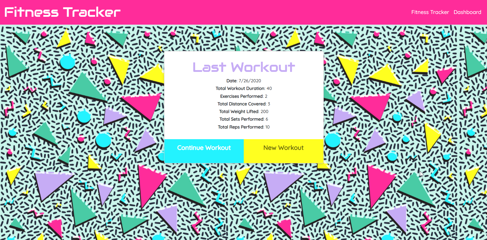
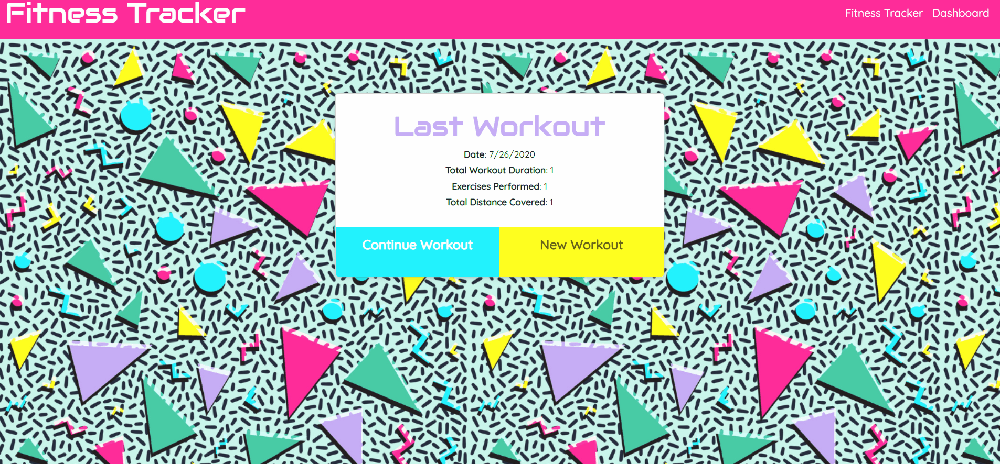

# Fitness Tracker

 


### URL: n/a

## Description

An application to create and track details of daily workouts using a NoSQL (MongoDB) Database.




## Table of Contents

* [Installation](#installation)
* [Usage](#usage)
* [Future Enhancements](#future-enhancements)
* [Credits](#Credits)
* [Questions](#questions)


## Installation

### General Setup
```
fork repo
clone to local machine 
npm i to install packages
node server to run
navigate to http//:localhost:3000/
```
### MongoDB setup
```
1. Open an instance of GitBash and run `mongod` prior to executing other commands
2. Open another GitBash instance, and run `mongo` to enter MongoDB
3. `db` will refer to the current datbase (by default is `test`)
4. `use workout` to switch to db (will create if doesn't exist)
5. To seed, run `npm run seed`
```

## Usage

1. Click "New Workout" to add an exercise to a workout 
2. Select Resistance or Cardio and fill out the fields 
3. Click "Add Exercise" to store the data from the exercise to the workout. 
4. Click "Complete" to conclude adding exercises to the workout.  
5. Click "Continue Workout" to add more exercies to a workout that hasn't been completed 
6. View the summary of the Last Workout on the main page 
7. View a breakdown of the workout data in graphs on the dashboard



## Future Enhancements
No further development is planned at this time except for minor styling enahnacements


## Credits

* [Bootstrap](https://getbootstrap.com/)

* [Express.js](https://www.npmjs.com/package/express)

* [Mongoose](https://www.npmjs.com/package/mongoose)

* [MongoDB](https://www.mongodb.com/)

* Front end files provided by trilogy


## Questions?

Contact me at [darian.nocera26@gmail.com](mailto:darian.nocera26@gmail.com) 

or [](http://www.github.com/darnocer)

Copyright © 2020 [Darian Nocera](http://www.github.com/darnocer)

---

##### _Created with [darnocer's README generator](https://github.com/darnocer/Node.js-and-ES6-README-Generator)_ 👽

